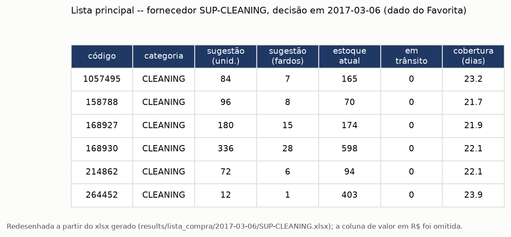
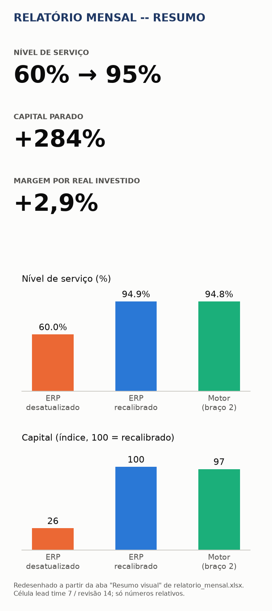
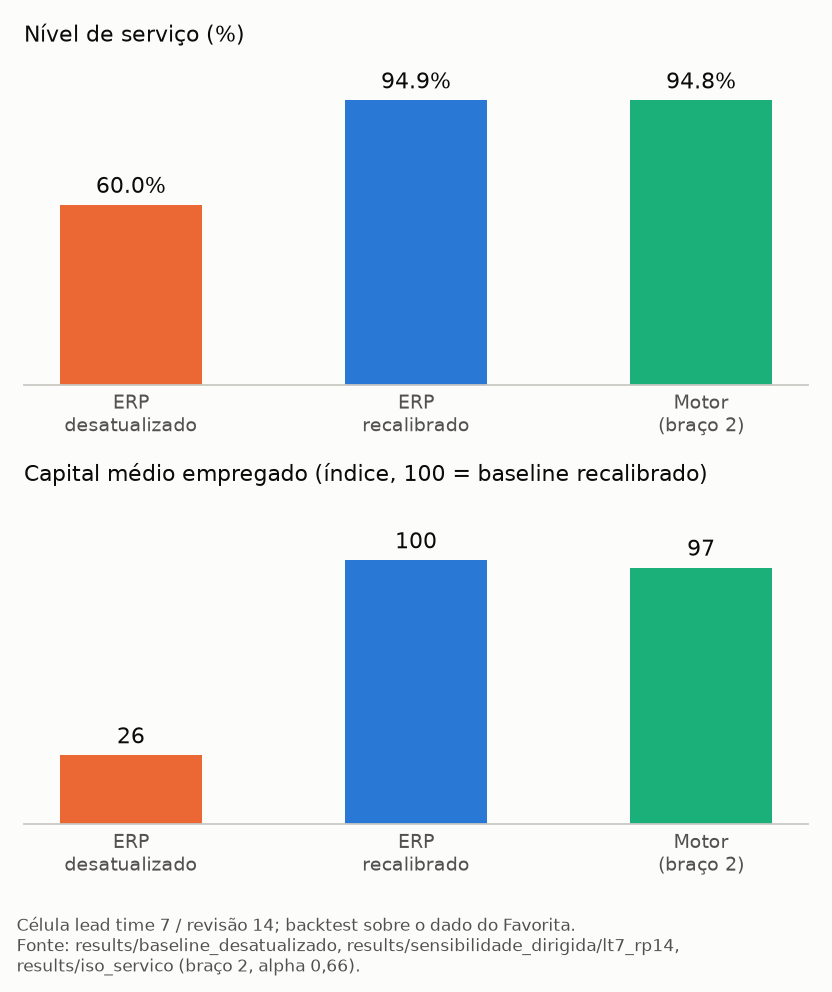

# Motor de decisão de compra

> **English, in three lines.** A purchase-decision engine for small and mid-size supermarkets: for each item it decides how much to order, per supplier, under the supplier's rules, and it proves its value by simulation against the naive rule an ERP uses today.
> Measured on one public dataset (Corporación Favorita), one store, one lead-time/review cell (7/14 days) — every number below is relative and has its source next to it.
> The client-data path (ERP export and invoice XML) was tested **only with fictitious data**; no real client has been run yet. Details and limits below, in Portuguese.

Motor que decide **quanto pedir de cada item** na compra semanal de um supermercado, por fornecedor, respeitando as regras de cada um (fardo, pedido mínimo, dia de pedido). Serve ao dono e ao comprador de supermercado pequeno e médio. O produto é a **decisão de quantidade**; a previsão é uma peça interna e substituível, e a prova de valor é financeira, feita por simulação.

## O problema

- A compra é feita no olho: memória do encarregado, olhada na gôndola, pressão de representante.
- O ERP só registra o que foi **vendido**. O item que faltou, e a margem que não entrou, não aparece em relatório nenhum.
- O grande varejo já resolveu isso com planejamento de reposição. O pequeno e o médio ficaram de fora.

*(Fonte: [`docs/documento_negocio_v2.md`](docs/documento_negocio_v2.md), seção 1.)*

## O que o sistema entrega

**1. A lista de compra semanal, por fornecedor.** Uma lista principal, para o comprador conferir e aprovar em bloco, e uma lista de exceções, revisada linha a linha (item novo, item parado, desvio grande, regra de guarda acionada). Sai um arquivo por fornecedor e um arquivo da semana, com uma aba por fornecedor na ordem dos dias de pedido. O sistema **não escreve no ERP nem emite pedido**: o comprador decide.



**2. O relatório mensal.** Abre numa aba de resumo que cabe na tela do celular: nível de serviço, capital parado e margem por real, com dois gráficos pequenos.



*(Exemplos gerados sobre o dado público do Favorita. Arquivos reais em [`docs/entregaveis/`](docs/entregaveis/). As imagens são redesenhadas a partir dos xlsx, não são capturas de tela, e a coluna de R$ foi omitida: ver "O que foi medido".)*

## Como funciona


- **Dados.** Tudo entra em quatro tabelas padrão (vendas, itens, fornecedores, estoque). Nada abaixo da camada de entrada conhece o formato original do arquivo.
- **Previsão.** Prevê a demanda **acumulada** na janela de risco (prazo de entrega + intervalo de revisão), em quantis, nunca a demanda diária. Somar quantis diários é matematicamente errado.
- **Decisão.** Enche o estoque até um nível-alvo que é um quantil da demanda da janela (a conta de custo de faltar contra custo de sobrar). Depois aplica as regras do fornecedor, sempre arredondando o fardo para cima, e as regras de guarda.
- **Entrega.** A lista por fornecedor e o relatório mensal.
- **Simulador.** Reproduz o histórico dia a dia (recebe, vende, envelhece, decide, registra) e mede o resultado em R$. Venda não atendida é venda perdida, não pedido pendente. Cada decisão só vê dados anteriores a ela.

*(Fonte: [`CLAUDE.md`](CLAUDE.md), seções 3, 5 e 6.)*

## O que foi medido

Backtest sobre o dado público do Favorita: **uma loja (a 44), 275 itens, 277 dias avaliados**, na **célula lead time 7 dias / revisão 14 dias**. Todos os resultados abaixo são **relativos**.

| O que se compara | Nível de serviço | Resultado | Fonte |
|---|---|---|---|
| **Andar 1.** Corrigir o fator de reposição do próprio ERP, sem modelo: baseline desatualizado → recalibrado | **60,0% → 94,9%** | capital médio empregado **×3,84 (+284%)**; ruptura em margem **−87%** | `results/baseline_desatualizado/calibrado_lt3_rp7` e `results/sensibilidade_dirigida/lt7_rp14` |
| **Andar 2.** Motor (braço estatístico, α = 0,66) contra o baseline **já recalibrado**, no mesmo serviço | **94,84% contra 94,85%** (−0,018 p.p.) | capital **−2,80%**; margem por real investido **+2,88%** | `results/iso_servico/README.md` |
| Onde está o ganho do motor | — | distribuído pelo portfólio: correlação de Spearman **0,275** entre o ganho do item e a proporção de dias com venda | `results/iso_servico/resumo_decomposicao_alpha066.json` |



Quatro coisas que a tabela não diz sozinha:

- **O custo vem junto do benefício.** Sair de 60% para 95% de serviço exige guardar mais estoque, não menos: +284% de capital. Quem corrige o fator precisa saber dos dois lados antes de assinar.
- **O Andar 1 é a parte maior da conta, e não usa modelo.** O ganho do Andar 2 é real, mas menor. Ele foi medido contra o baseline já corrigido, não contra o ERP desatualizado.
- **Margem por real investido** é a margem realizada menos a perda, dividida pelo capital médio empregado (`decision_metric`). É a métrica que ordena as políticas (`CLAUDE.md`, seção 7).
- **Valores em R$ são ilustrativos.** O relatório mensal e a apresentação trazem R$, mas saem de preço uniforme de R$ 10 e de margens por categoria arbitradas, aplicados a dado de uma loja do Equador. Só os relativos acima são afirmados pelo projeto.

## Como sabemos que funciona

1. **Um teste com resposta de papel e caneta.** Com demanda constante *d*, prazo de entrega *L* e revisão *R*, uma política que enche até *d × (L + R)* tem de chegar a estado estacionário: serviço de 100%, pedido de exatamente *d × R* a cada revisão e estoque médio de *d × (R + 1) / 2*. O teste exige esses três números. Se ele não fechasse, o simulador estaria errado e nada construído em cima valeria. (`tests/test_simulator.py::test_regime_permanente_estoque_medio_e_nivel_de_servico`)
2. **Comparação no mesmo nível de serviço (iso-serviço).** Comparar margem por real entre políticas com serviços diferentes engana: o ERP desatualizado chegou a parecer mais "eficiente" só porque abastecia pouco (60–66% de serviço) e carregava menos estoque. Por isso o motor é medido no ponto em que o serviço dele iguala o do baseline.
3. **Baseline honesto.** O ERP de comparação é implementado de verdade, não estrangulado, e recalibrado para a célula medida. O ERP desatualizado é um braço à parte, para mostrar de onde vem o ganho do Andar 1.
4. **Sem espiar o futuro.** O simulador entrega à previsão uma fatia já filtrada (só datas anteriores à decisão), e há teste para isso (`test_forecaster_nunca_recebe_historico_com_data_maior_ou_igual_ao_as_of`). O que já foi pedido e não chegou é descontado antes de pedir de novo.
5. **Testes e cobertura, medidos em 2026-10-05 com `uv run pytest`:** **492 testes passando e 86% de cobertura.** O simulador, a política de nível-alvo, o baseline do ERP, as regras de guarda e as restrições de fornecedor ficam entre 98% e 100%. `ruff` e `mypy` passam. Esses números envelhecem: refaça o comando antes de citá-los.

O que isto **não** prova: tudo é backtest sobre dado público, a ruptura é inferida pelo simulador (o dado não tem estoque), e nada foi rodado com um cliente real. Ver "Limitações".

## De onde vêm os dados

- **MVP: Corporación Favorita** (Kaggle), uma rede de supermercados do Equador, 2013–2017. É dado real de vendas, mas **sem saldo de estoque**, sem custo e sem preço. O projeto declara isso como premissa ativa em vez de escondê-lo.
- **Cliente: exportação do ERP em CSV (vendas, cadastro, fornecedores, pedidos em aberto) e NF-e de entrada em XML 4.00** (Sprint 22). A NF-e dá o custo real, o fornecedor e o fardo; as regras de fornecedor (dia de pedido, prazo, mínimo) vêm da entrevista.

**Honestidade sobre a portabilidade.** Isso foi testado **só com dado fictício** (ainda não houve dado de cliente real). Para a promessa "o contrato torna o motor portável para o ERP de um cliente" ficar de pé, **foi preciso mudar `purchase_list.py`**, e não só acrescentar uma coluna: rodar a lista sobre tabelas do cliente achou quatro acoplamentos ao Favorita. O modo original continua com saída idêntica (teste de regressão, mais a regeneração real da lista de 2017-03-06 comparada célula a célula: 3.250 células, nenhuma diferença). Os quatro acoplamentos, como registrados no `CLAUDE.md`:

> A promessa NÃO fechou só com a coluna de descrição que o plano previa: rodar `generate_purchase_list` sobre tabelas do cliente (passo 0) achou QUATRO acoplamentos ao Favorita em `reporting/purchase_list.py`, nesta ordem: (1) o fardo vinha de `purchase_list_supplier_assumptions.pack_multiple_by_category` (`KeyError` em categoria que não é do Favorita) e `Item.pack_multiple` nunca era lido; (2) a validade vinha de `guardrails.shelf_life_days_by_category` (idem) -- este foi resolvido SEM mudar o módulo, porque `client_params_for` (em `io/`) deriva a validade por categoria do cadastro; (3) a lista exigia UMA categoria por fornecedor (`ValueError`; verdade no Favorita, `supplier_id=SUP-<CATEGORY>`, falsa para qualquer distribuidor), e pedido mínimo, lead time e revisão também eram assumidos do Favorita (`min_order_value_by_category`; `cell_suppliers` sobrescreve para 7/14), nunca lidos de `Supplier`; (4) `on_hand`, `in_transit` e a média de compras recentes do limite de variação vinham de rodar o `Simulator` até a véspera -- para um cliente, estoque INVENTADO.

*(Fonte: `CLAUDE.md`, emenda da Sprint 22.)*

## Limitações

Copiadas dos documentos de origem, sem suavizar.

**De [`docs/documento_negocio_v2.md`](docs/documento_negocio_v2.md), seção 9 (Riscos):**

- **Qualidade de cadastro no cliente** pode inviabilizar a análise antes de qualquer modelo. Mitigação: auditoria de cadastro como primeira entrega.
- **Comprador humano é bom nos itens de alto giro.** Não posicionar como "eu bato o comprador" — e não posicionar a cobertura de cauda como fonte do ganho medido: o MVP mediu vantagem distribuída pelo portfólio, levemente maior nos itens de venda REGULAR, não nos irregulares (correlação fraca, Spearman 0,275 — contraria a tese original desta seção na v1). O argumento que se sustenta é de cobertura operacional: ele revisa bem 200 itens, o motor cobre 3.000 — ninguém troca isso por atenção humana a mais, mas o dinheiro não vem primariamente daí.
- **Perda não foi demonstrada.** O dado público não tem saldo de estoque — ruptura não é observável nele (é inferida pelo simulador, não medida), e perda por validade/vencimento não é modelada em nenhum braço (R$ 0,00 sempre, no MVP inteiro). O que o MVP prova é melhor alocação de capital e margem recuperada em ruptura, não redução de perda — perda evitada, como métrica do relatório mensal (seção 3), continua sem validação até haver dado real de estoque do cliente.
- **Validade restrita a uma célula.** Todo número desta versão (Andares 1 e 2, seção 2) foi medido numa única combinação de lead time e ciclo de revisão (7 e 14 dias). Generalizar para outras combinações — outro fornecedor, outro prazo de entrega — é hipótese, não resultado medido.
- **Consultoria de margem se esgota** — e isso agora vale também para o Andar 1 (seção 2): se a maior parte do valor medido está em corrigir uma calibração errada, essa é uma correção que se faz uma vez, não um serviço recorrente. A porta de entrada fica mais barata de entregar e mais fácil de provar — mas se esgota do mesmo jeito que a consultoria de margem sempre se esgotou. A recorrência continua onde sempre esteve: na reposição semanal (Andar 2 + operação da lista), não no diagnóstico inicial. Diagnóstico é porta de entrada; reposição é o contrato.
- **Falta de informação de promoção** degrada a previsão exatamente nos itens de maior volume.

**Seção 4:**

> **Limitação de desenho, medida no MVP:** o teto de cobertura (regra 1) só é uma guarda ATIVA quando a validade do produto é menor que a janela de risco (lead time + ciclo de revisão). Em categoria perecível com ciclo de revisão longo — a janela de risco maior que a própria validade —, o teto vira estruturalmente inoperante: não existe quantidade que viole um teto que a janela de risco já ultrapassa por conta própria. Proteção real, nesse caso, exige ciclo de revisão POR FORNECEDOR, não um valor único para o portfólio inteiro — o simulador do MVP não suporta isso hoje. Isto é débito de arquitetura, não bug: o teto continua correto como validade física; só não é a guarda ativa que se esperava dele justamente nas categorias mais sensíveis.

**Seção 6:**

> **Limitação a declarar abertamente:** dado público não tem saldo de estoque, então ruptura não é observável nele. A correção de demanda censurada é projetada no MVP mas só é validável com dado de cliente.

**De [`CLAUDE.md`](CLAUDE.md):**

> Duas ressalvas continuam verdadeiras: (1) `promocao_prevista` e `item_ancora` seguem FORA — `guardrails.py` declara ambas como "não implementada" (exigem calendário promocional e análise de cesta; `Item.is_anchor` é 100% nulo no canônico); (2) as guardas só atuam na lista de compra, NÃO no simulador de portfólio — os números do relatório mensal e da comparação iso-serviço não incluem o efeito delas (custo do seguro das guardas sobre as métricas é experimento declarado à parte, ainda não feito).

> Também fica registrado que valores absolutos em R$ do relatório mensal, da apresentação e do documento de negócio saem de `uniform_unit_price` e de margens arbitradas: são ilustrativos; os relativos (nível de serviço, variação % de capital e de ruptura, margem por real) são o que o projeto afirma.

> Limitações declaradas: a NF-e NÃO traz data de chegada nem do pedido, então o lead time vem da entrevista e não é observável pela nota; o custo (`vProd - vDesc + vIPI + vICMSST`, por `qTrib`) deixa de fora o frete; `alpha=0,66` foi calibrado na célula lead_time=7/review_period=14 e, com os prazos do cliente, é uma combinação NÃO MEDIDA (a aba Notas diz); o layout da NF-e foi conferido por teste estrutural, não contra o XSD oficial; só CSV (sem Excel); NFC-e de venda é o próximo passo, fora desta sprint; no arquivo semanal (`motor.reporting.purchase_week`) a restrição de caixa vale por data de decisão, não sobre a semana inteira.

**Braço 3 (LightGBM).** O braço 3 (LightGBM) não foi comparado no mesmo nível de serviço. Uma medição preliminar sugere ganho maior que o do braço estatístico, ainda não confirmado. A v1 usa o braço estatístico por ser mais simples, auditável e não exigir retreino. A medição em iso-serviço está registrada como próxima sprint no `CLAUDE.md`; até lá, nenhum número do braço 3 é citado.

## Como rodar

Requer [uv](https://docs.astral.sh/uv/) e Python 3.12.

```bash
uv sync
```

### Verificação

```bash
uv run pytest
uv run ruff check .
uv run mypy
```

### Demonstração sem baixar nada (dado fictício)

Gera a lista de compra da semana a partir de uma exportação de cliente **inventada** (`tests/fixtures/cliente_exemplo/`: vendas, cadastro, fornecedores, pedidos em aberto e três NF-e). Sai um xlsx por fornecedor e o arquivo da semana.

```bash
uv run python -m motor.reporting.purchase_week \
    --client-dir tests/fixtures/cliente_exemplo \
    --store-id LOJA-EXEMPLO --store-cnpj 55566677000188 \
    --week-start 2024-05-06 --output-dir saida/
```

A auditoria de cadastro do mesmo exemplo (os achados foram plantados de propósito):

```bash
uv run python -m motor.reporting.auditoria_cadastro \
    --input-dir tests/fixtures/cliente_exemplo --store-id LOJA-EXEMPLO \
    --store-cnpj 55566677000188 --output saida/auditoria.xlsx --illustrative
```

Com dado de um cliente real, o diretório de entrada fica em `data/cliente/`, que o `.gitignore` mantém fora do git (`*.csv` e `*.xml` ficam ignorados fora de `tests/fixtures/`).

### Reproduzir com o Favorita

Os dados **não estão no repositório**.

1. **Baixe o dado.** É a competição **"Corporación Favorita Grocery Sales Forecasting"**, no Kaggle (`favorita-grocery-sales-forecasting`). Exige conta no Kaggle e aceitar as regras da competição; os arquivos vêm em `.7z` e não podem ser redistribuídos, por isso não estão aqui. Extraia (por exemplo, `7z x train.csv.7z`) para `data/raw/favorita/` deixando estes seis arquivos: `train.csv`, `items.csv`, `stores.csv`, `oil.csv`, `holidays_events.csv`, `transactions.csv`. Os caminhos esperados estão em `config/params.yaml`, seção `data`.
2. **Converta para parquet** (sem transformar nenhum valor; o `train.csv` tem ~125 milhões de linhas):
   ```bash
   uv run python -m motor.io.raw --convert
   ```
3. **Gere as quatro tabelas canônicas.** Ainda não existe um comando próprio para isto (a função é chamada só pelos testes), então:
   ```bash
   uv run python -c "
   from pathlib import Path
   from motor.config import load_params
   from motor.io.loaders import build_canonical_favorita
   p = load_params(Path('config/params.yaml'))
   build_canonical_favorita(Path(p.data.raw_parquet_dir), Path(p.data.canonical_dir), p)
   "
   ```
4. **Gere a lista de compra** de uma data (cerca de 5 minutos com a seleção do subconjunto já em cache; a primeira execução também faz a seleção, que fica em `results/subset_selection.json`):
   ```bash
   uv run python -m motor.reporting.purchase_list --as-of 2017-03-06 --output-dir results/lista_compra/2017-03-06
   ```
5. **Gere o relatório mensal.** Ele não roda simulação: lê resultados que precisam existir em `results/`. Produzi-los leva horas, e **estes comandos não foram reexecutados em 2026-10-05** (só a ajuda de cada um foi conferida):
   ```bash
   # baseline recalibrado na célula 7/14 e os baselines das células de partida do ERP desatualizado
   uv run python -m motor.experiments.sensitivity --run-directed-unit --lead-time 7 --review-period 14
   uv run python -m motor.experiments.sensitivity --run-directed-unit --lead-time 3 --review-period 7
   uv run python -m motor.experiments.sensitivity --run-directed-unit --lead-time 5 --review-period 7
   uv run python -m motor.experiments.stale_baseline --run-all
   # motor (braço estatístico, alpha 0,66)
   uv run python -m motor.experiments.iso_service --run-point --arm estatistico_basestock --alpha 0.66 --output results/iso_servico/ponto_arm2_alpha066.json
   uv run python -m motor.experiments.iso_service --item-decomposition --alpha 0.66 --output-dir results/iso_servico
   ```
   **Lacuna conhecida:** o relatório lê `results/iso_servico/arm2_alpha_grid.parquet`, e nenhum código do repositório o monta a partir dos arquivos de `--run-point`. A reprodução do zero não é totalmente automatizada até existir esse passo. Com os resultados no lugar:
   ```bash
   uv run python -m motor.reporting.monthly_report
   uv run python notebooks/gerar_imagens_readme.py   # as três imagens deste README
   ```

## Mapa do repositório

| Caminho | O que tem |
|---|---|
| `config/params.yaml` | Todas as premissas numéricas (nenhum número mágico no código) |
| `src/motor/io/` | Entrada: Favorita, exportação de cliente (CSV), NF-e (XML), contratos das quatro tabelas |
| `src/motor/forecast/`, `src/motor/policy/` | Previsão (naïve, estatística, LightGBM) e política (baseline do ERP, nível-alvo, fornecedor, guardas) |
| `src/motor/simulator/` | O loop diário, o centro do sistema |
| `src/motor/metrics/`, `src/motor/experiments/` | Conversão para R$ e execução de cada braço |
| `src/motor/reporting/` | Lista de compra, arquivo da semana, auditoria de cadastro, relatório mensal |
| `notebooks/` | Só exploração e gráficos (lógica de negócio nunca vive aqui) |
| `tests/` | Testes, inclusive as fixtures fictícias de cliente |
| [`docs/documento_negocio_v2.md`](docs/documento_negocio_v2.md) | O que é o produto, o que foi medido e os riscos |
| [`CLAUDE.md`](CLAUDE.md) | Arquitetura, contratos, decisões e o histórico de emendas |
